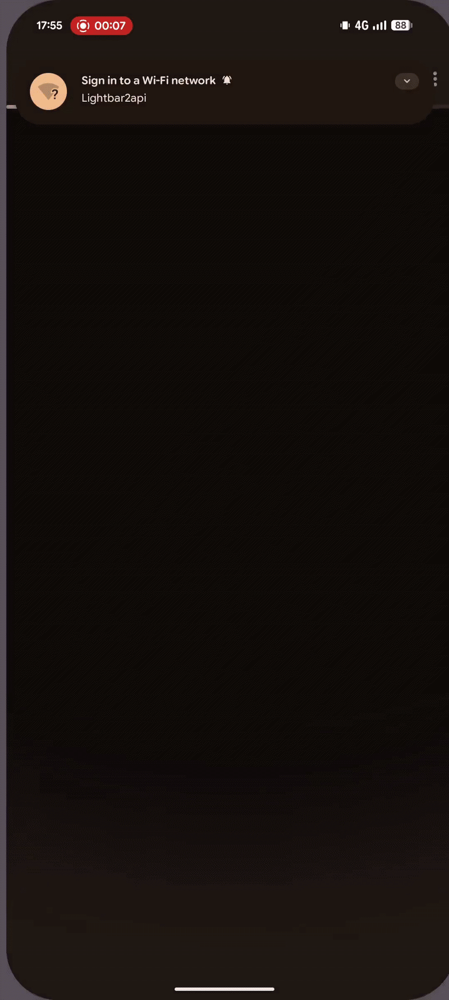
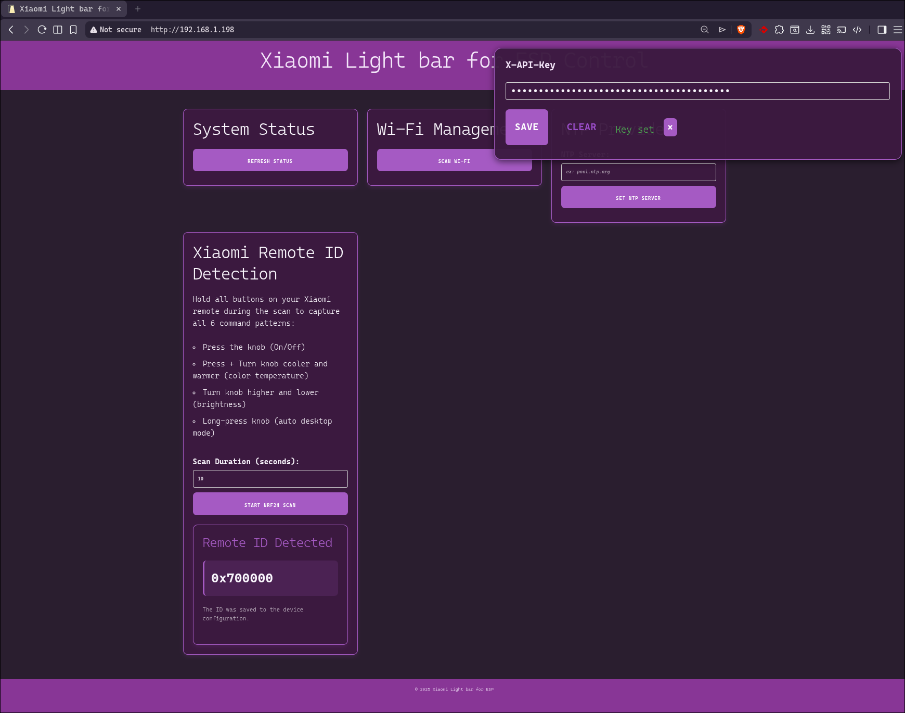
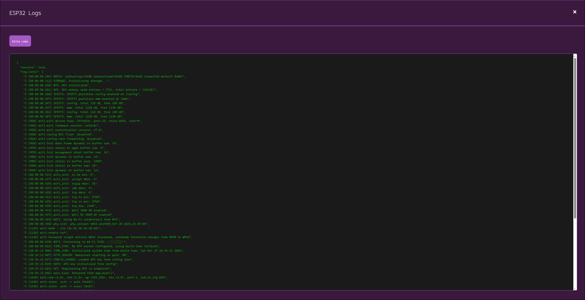

# Light Bar 2 API

> Transform your Xiaomi light bar into a smart, networked device with REST API

<div align="center">
  <br/>

[](https://github.com/Times-Z/light-bar-2-api/releases)
[](https://github.com/Times-Z/light-bar-2-api/actions)
[](LICENSE)

  <br/>

**Light bar 2 API** is an open-source firmware solution for the Xiaomi Light Bar (MJGJD01YL) that enables complete wireless control via a RESTful API. Built on ESP32 with an NRF24L01 transceiver

  <br/>

<table>
  <tr>
    <td></td>
    <td></td>
    <td></td>
    <td></td>
  </tr>
</table>

</div>

---

## Credits

This project builds upon the excellent reverse engineering work by:

- **[Lamperez](https://github.com/lamperez/xiaomi-lightbar-nrf24)**
- **[Benallen](https://github.com/benallen-dev/xiaomi-lightbar)**
- **[Ebinf](https://github.com/ebinf/lightbar2mqtt)**

---

## Table of contents

- [Prerequisites](#-prerequisites)
- [Hardware Setup](#-hardware-setup)
- [Installation](#-installation)
- [Configuration](#-configuration)
- [API Documentation](#-api-documentation)
- [Features](#-features)
- [Technical Details](#-technical-details)
- [Contributing](#-contributing)
- [License](#-license)

---

## Prerequisites

### Software requirements

#### Using devcontainer (zero setup)

The project includes a **pre-configured devcontainer** with everything pre-installed:

- Python 3.12
- ESP-IDF 5.5+
- ESP32 toolchain
- VS Code extensions
- Build tools

**Simply clone and open:**

```bash
git clone https://github.com/Times-Z/light-bar-2-api.git
code light-bar-2-api
# Click "Reopen in Container" when prompted
```

All dependencies are automatically available inside the container \o/

#### Manual setup

If you prefer not to use devcontainer, install manually:

| Tool        | Version | Purpose                     |
| ----------- | ------- | --------------------------- |
| **Python**  | 3.12+   | Build system dependency     |
| **ESP-IDF** | 5.5+    | ESP32 development framework |

Then configure ESP-IDF following the [official guide](https://docs.espressif.com/projects/esp-idf/en/v5.5.2/esp32/get-started/index.html#manual-installation)

---

## Hardware setup

### Required components

| Component           | Model             | Notes                      |
| ------------------- | ----------------- | -------------------------- |
| **Microcontroller** | ESP32 (WROOM-32E) | Tested development board   |
| **Radio module**    | NRF24L01+PA+LNA   | Tested 2.4GHz transceiver  |
| **Smart light bar** | MJGJD01YL         | Xiaomi model (no BLE/WiFi) |

> **Compatibility note:** MJGJD02YL is **not compatible** since this model is already connected

### Pinout

```
┌─────────────┐               ┌──────────┐
│   NRF24     │───────────────│  ESP32   │
├─────────────┤               ├──────────┤
│ VCC    ────────────────────→ 3V3       │
│ GND    ────────────────────→ GND       │
│ CE     ────────────────────→ GPIO 4    │
│ CSN    ────────────────────→ GPIO 5    │
│ SCK    ────────────────────→ GPIO 18   │
│ MOSI   ────────────────────→ GPIO 23   │
│ MISO   ────────────────────→ GPIO 19   │
└─────────────┘               └──────────┘
```

| NRF24 Pin | Function    | ESP32 Pin |
| :-------- | :---------- | --------: |
| VCC       | Power       |       3V3 |
| GND       | Ground      |       GND |
| CE        | Chip Enable |    GPIO 4 |
| CSN       | Chip Select |    GPIO 5 |
| SCK       | SPI Clock   |   GPIO 18 |
| MOSI (M0) | Data Out    |   GPIO 23 |
| MISO (M1) | Data In     |   GPIO 19 |

### Tested devices

- [Mi computer monitor light bar](https://www.mi.com/fr/product/mi-computer-monitor-light-bar/)
- [ESP-32S ESP-WROOM-32E](https://fr.aliexpress.com/item/1005004275519535.html)
- [NRF24L01+PA+LNA](https://amzn.eu/d/drTwkjU)

---

## Flash memory layout

The firmware uses a custom partition scheme optimized for storage and performance:

| Partition | Type | SubType | Offset   | Size    | Purpose                     |
| :-------- | :--- | :------ | :------- | :------ | :-------------------------- |
| `nvs`     | data | nvs     | 0x9000   | 512 KB  | Configuration & credentials |
| `factory` | app  | factory | 0x90000  | 2048 KB | Main firmware binary        |
| `config`  | data | spiffs  | 0x290000 | 128 KB  | JSON settings files         |
| `www`     | data | spiffs  | 0x2B0000 | 1344 KB | Web interface assets        |

---

## Installation

### Step 1: clone the repository

```bash
git clone https://github.com/Times-Z/light-bar-2-api.git
cd light-bar-2-api
```

### Step 2: set up ESP-IDF

**Option A: Using VS code extension**

1. Install the **ESP-IDF** extension in VS Code
2. Follow the extension's setup wizard
3. Select ESP-IDF v5.5+

**Option B: Using devcontainer**

No setup needed! The devcontainer handles everything

### Step 3: Configure the project

#### Method 1: JSON configuration (boot-time)

Create your config file:

```bash
cp main/config/default.json main/config/config.json
```

Edit `main/config/config.json`:

```json
{
  "wifi_ssid": "Your_WiFi_Network",
  "wifi_password": "Your_WiFi_Password",
  "api_key": "your_secure_api_key",
  "ntp_server": "pool.ntp.org",
  "xiaomi_remote_id": "00000000" # <==if you already have it, however a endpoint of the API help you to get it
}
```

**Note:** This file is used only on first boot. Afterward, configuration persists in NVS

#### Method 2: Web UI / REST API

Once the device boots:

1. Connect to wifi or access the captive portal
2. Open the web dashboard
3. Configure settings through the UI
4. Changes are saved automatically to NVS

#### WiFi access point mode

If WiFi credentials are missing or invalid:

- **SSID:** `Lightbar2api`
- **Password:** `$tr0ngWifi`
- **Portal:** Auto-opens on compatible devices (iOS/Android), otherwise go to `http://10.0.1.1`

---

## Build & flash

### Build the firmware

```bash
idf.py build
```

### Flash to ESP32

```bash
idf.py flash
```

### Monitor serial output

```bash
idf.py monitor
```

**Note:** All of this commands can be used at the same time, eg : `idf.py build flash monitor`

---

## API documentation

Complete API endpoints are documented in the [Swagger/OpenAPI specification](./swagger.yml).

---

## Features

### Implemented

- [x] REST API with HTTP endpoints
- [x] WiFi Access Point (AP) mode with captive portal
- [x] WiFi Station (STA) mode with auto-connect
- [x] JSON configuration files
- [x] Persistent NVS storage (credentials & settings)
- [x] System uptime tracking
- [x] API key authentication (X-API-Key header)
- [x] NTP time synchronization
- [x] Log streaming via web UI
- [x] Xiaomi remote ID scanning & storage
- [x] Xiaomi power on/off control

### Planned

- [ ] Additional light commands (color, brightness, effects)
- [ ] Web interface improvements

---

## Technical details

### Data whitening algorithm

The nRF24 module uses **whitening** to ensure reliable radio communication:

**Why is it important?**

- **Clock recovery:** Ensures receiver stays synchronized
- **DC balancing:** Prevents frequency offset
- **Signal quality:** Reduces electromagnetic interference

**How it works:**

1. **LFSR (Linear Feedback Shift Register)** generates pseudo-random bits
2. **XOR operation** scrambles the payload with the random sequence
3. **Receiver applies** the same algorithm with the same seed to recover data

**Implementation in this project:**

The whitening is applied in [`nrf24_build_xiaomi_frame`](main/nrf24/nrf24.c#L298) as the final step before transmission, scrambling the entire 18-byte frame while maintaining protocol integrity

---

## License

This project is licensed under the **MIT License** - see the [LICENSE](LICENSE) file for details

---

## Support

- Check the [Swagger API documentation](./swagger.yml) for endpoint details
- Found a bug? [Open an issue](https://github.com/Times-Z/light-bar-2-api/issues)
- Have questions? [Start a discussion](https://github.com/Times-Z/light-bar-2-api/discussions)

---

<div align="center">

**Made with ❤️**

[Star us on GitHub](https://github.com/Times-Z/light-bar-2-api) if you find this project useful!

</div>
